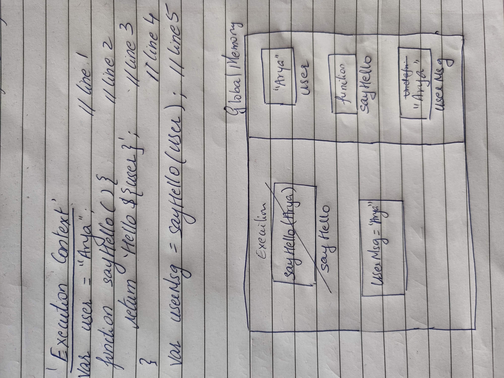
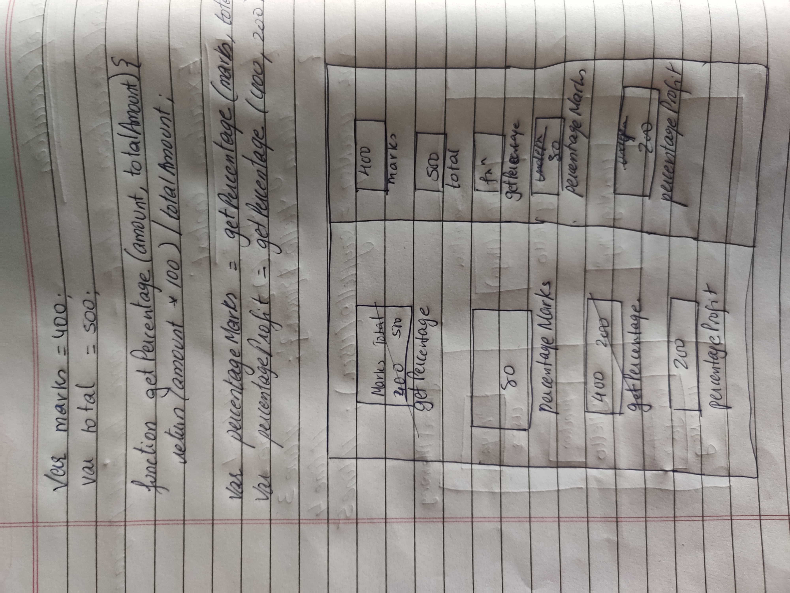

1. What does thread of execution means in JavaScript?
Javascript goes through our code, line by line and they call this the thread of execution.

2. Where the JavaScript code gets executed?
Everything in JavaScript happens inside an "Execution Context”. Whenever a JavaScript program is run an execution context is created. In this phase, javascript allocates the memory to all the variables and functions present in the program.


3. What does context means in Global Execution Context?
This context wraps all of our JavaScript code and provides a global environment for us to reference/ access any globally scoped variables or functions from the window object.


4. When do you create a global execution context.
When the JavaScript Engine is interpreting our code, the first thing it does is create a Global Execution Context. 

5. Execution context consists of what all things?
1)Creation Phase or Memory Creation
2)Code Execution Phase


6. What are the different types of execution context?
The Global Execution Context.
The Local or Function Execution Context.


7. When global and function execution context gets created?
The first thing javascript does is create a Global Execution Context. This context wraps all of our JavaScript code and provides a global environment for us to reference/ access any globally scoped variables or functions from the window object.

When a function is invoked, a Local Execution Context is created. The responsibility of this context is to parse the called function and return the result to our global environment.

8. Function execution gets created during function execution or while declaring a function.
During function execution.

9. Create a execution context diagram of the following code on your notebook. Take a screenshot/photo and store it in the folder named `img`. Use `` to display it here.


```js
var user = "Arya";

function sayHello(){
  return `Hello ${user}`;
}

var userMsg = sayHello(user);
```

<!-- Put your image here -->




```js
var marks = 400;
var total = 500;

function getPercentage(amount, totalAmount){
  return (amount * 100) / totalAmount;
}

var percentageMarks = getPercentage(marks, total);
var percentageProfit = getPercentage(400, 200);
```

<!-- Put your image here -->




```js
var age = 21;

function customeMessage(userAge){
  if(userAge > 18){
    return `You are an adult`;
  }else {
    return `You are a kid`;
  }
}

var whoAmI = customeMessage(age);
var whoAmIAgain = customeMessage(12);
```

<!-- Put your image here -->

